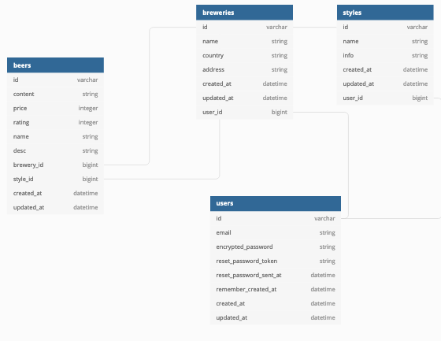

# README

Ruby On Rails Final CRUD

URL: https://rubyinaleploy.herokuapp.com/

Usage: Gestion d'un listing de produits de types biéres, associé à leurs brasserie et style.

Biéres:
  - Ajout d'une fiche d'information d'une biére
  - Modification d'une fiche d'information d'une biére
  - suppression d'une fiche d'information d'une biére
  - Consulation d'une fiche d'information d'une biére

  Brasserie:
    - Ajout d'une fiche d'information d'une Brasserie
    - Modification d'une fiche d'information d'une Brasserie
    - suppression d'une fiche d'information d'une Brasserie
    - Consulation d'une fiche d'information d'une Brasserie

  Style:
    - Ajout d'une fiche d'information d'une Style
    - Modification d'une fiche d'information d'une Style
    - suppression d'une fiche d'information d'une Style
    - Consulation d'une fiche d'information d'une Style

Authentification via credentials user email/mots de passe.

Implémentaion d'une GEM de traduction du texte Francais/Anglais.
voir forlder gemdub.

Diagramme base de données:

